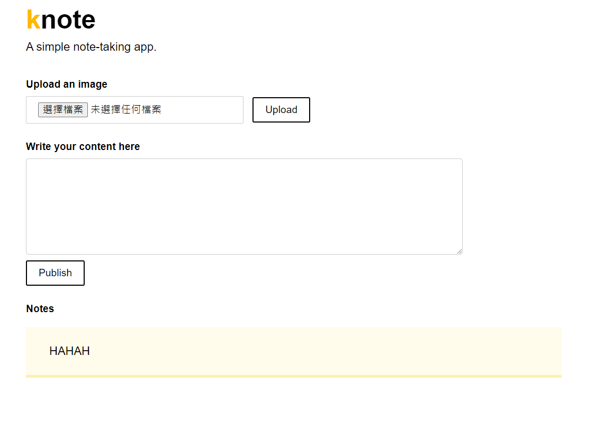

# README 
此專案原由學習mini kubernatites，為滿足練習
- build an java Application deploy to minikube
- 讓兩種不同性質 Pod image 同時在 minikube 連線共享資源
### 參考資料
https://learnk8s.io/spring-boot-kubernetes-guide

## Knote

### 介紹
- SprintBoot專案
- 連線mongoDB
- 上傳檔案存到mongoDB

### 注意事項
- 不要修改SpringBoot版本，會導致404網頁出不來，可能是CommonMark元件與SpringBoot先進版本會起衝突
- 執行前，先安裝```docker pull mongo``` 再執行mongoDB ```docker run -d --hostname mongo --name mongo -p 27017:27017 mongo:latest```

### 編譯
maven
``` 
mvn clean package
```
### 執行
maven
``` 
mvn spring-boot:run
```

### 畫面

http://localhost:8080/


### 取得專案
```bash
git clone https://github.com/jackcomtw/SpringBoot_mongoDB.git
```

### 安裝套件

### 環境變數說明
```env
MONGO_URL= # monoDB連線的主機，預設值:mongodb://localhost:27017/dev
```

## monDB

### 取得方式
```bash
docker pull mongo
```

# 整合執行
```
docker pull openjdk:11-jre
docker build -t knote-java --pull=false .
docker network create knote
docker run -d --name=mongo --rm --network=knote mongo
docker run -d --name=knote-java --rm --network=knote -p 8080:8080 -e MONGO_URL=mongodb://mongo:27017/dev knote-java 
```


# 停止
```
docker stop mongo knote-java
docker rm mongo knote-java
```


# 聯絡作者
